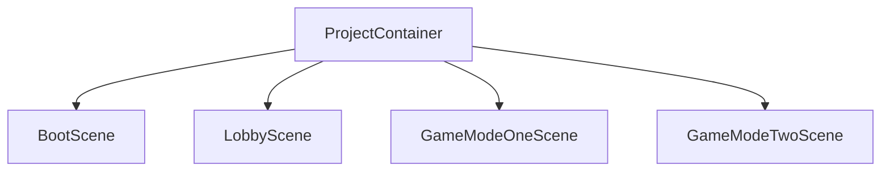
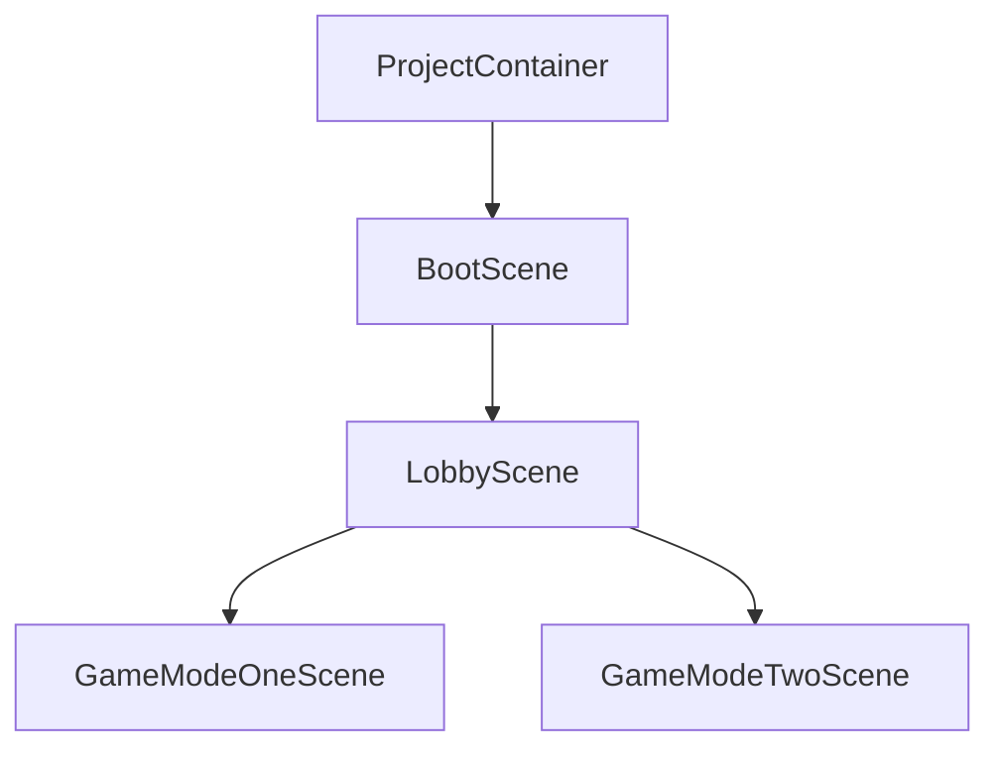

<div align=center>   

<p align="center">
  
</p>

### Blazing fast, minimal but complete dependency injection library for <a href="https://unity.com/">Unity</a>

Reflex is an [Dependency Injection](https://stackify.com/dependency-injection/) framework for [Unity](https://unity.com/). Making your classes independent of its dependencies, granting better separation of concerns. It achieves that by decoupling the usage of an object from its creation. This helps you to follow SOLID’s dependency inversion and single responsibility principles. Making your project more **readable, testable and scalable.**

[](https://discord.gg/XM47TsGScH)
[](https://opensource.org/licenses/MIT)

[](http://makeapullrequest.com)
[](https://github.com/gustavopsantos/reflex/releases)
[](https://openupm.com/packages/com.gustavopsantos.reflex/)
[](https://unity3d.com/pt/get-unity/download/archive)

</div>

---

<details>
<summary>📌 Table Of Contents</summary>

- [Overview](#-overview)
- [Installation](#-installation)
  - [Unity Package Manager](#unity-package-manager)
  - [Open Unity Package Manager](#open-unity-package-manager)
  - [Unity Package](#unity-package)
- [Getting Started](#-getting-started)
- [Execution Order](#-execution-order)
- [Injection Strategy](#-injection-strategy)
- [Container Hierarrchy](#-container-hierarchy)
- [Scopes](#-scopes)
- [Bindings](#-bindings)
- [Resolving](#-resolving)
- [Selective Resolution](#-selective-resolution)
- [Callbacks](#-callbacks)
- [Attributes](#-attributes)
- [Manual Injection](#-manual-injection)
- [Extensions](#-extensions)
- [Debugger](#-debugger)
- [Settings](#-settings)
- [Performance](#-performance)
- [Scripting Restrictions](#-scripting-restrictions)
- [Support](#-support)
- [License](#-license)

</details>

---

## 👀 Overview
- **Fast:** up to 414% faster than VContainer, up to 800% faster than Zenject.
- **GC Friendly:** up to 28% less allocations than VContainer, up to 921% less allocations than Zenject.
- **AOT Support:** Basically there's no runtime Emit, so it works fine on IL2CPP builds. [<sup>[*]</sup>](#-scripting-restrictions)
- **Contract Table:** Allows usages of APIs like `container.All<IDisposable>`
- **Immutable Container**: Performant thread safety free of lock plus predictable behavior.

Compatible with the following platforms:

- iOS
- Android
- Windows/Mac/Linux
- PS4/PS5
- Xbox One/S/X and Xbox Series X/S
- WebGL

---

## 💾 Installation
You can install Reflex using any of the following methods:

### Unity Package Manager
```
https://github.com/gustavopsantos/reflex.git?path=/Assets/Reflex/#10.1.0
```

1. In Unity, open **Window** → **Package Manager**.
2. Press the **+** button, choose "**Add package from git URL...**"
3. Enter url above and press **Add**.

### Open Unity Package Manager

```bash
openupm install com.gustavopsantos.reflex
```

### Unity Package
1. Download the .unitypackage from [releases](https://github.com/gustavopsantos/reflex/releases) page.
2. Import Reflex.X.X.X.unitypackage

---

## 🚀 Getting Started
1. [Install Reflex](#-installation)
2. Create `ProjectInstaller.cs` with 
```csharp
using Reflex.Core;
using UnityEngine;

public class ProjectInstaller : MonoBehaviour, IInstaller
{
    public void InstallBindings(ContainerBuilder builder)
    {
        builder.AddSingleton("Hello");
    }
}
```
3. In unity project window
4. Right click over any folder, Create → Reflex → ProjectScope. Since ProjectScopes is strongly referenced by ReflexSettings, you can create it anywhere, it does not need to be inside `Resources` folder.
5. Select `ProjectScope` you just created
6. Add `ProjectInstaller.cs` as a component
7. Create directory `Assets/Resources`
8. Right click over `Resources` folder, Create → Reflex → Settings. ReflexSettings should always be created inside `Resources` folder.
9. Select `ReflexSettings` ScriptableObject and add the `ProjectScope` prefab to the ProjectScopes list
10. Create new scene `Greet`
11. Add `Greet` to `Build Settings` → `Scenes In Build`
12. Create `Greeter.cs` with
```csharp
using UnityEngine;
using System.Collections.Generic;
using Reflex.Attributes;

public class Greeter : MonoBehaviour
{
    [Inject] private readonly IEnumerable<string> _strings;

    private void Start()
    {
        Debug.Log(string.Join(" ", _strings));
    }
}
```
13. Add `Greeter.cs` to any gameobject in `Greet` scene
14. Inside Greet scene, create a new empty gameobject named `SceneScope` and attach `SceneScope` component
15. Create `GreetInstaller.cs` with
```csharp
using Reflex.Core;
using UnityEngine;

public class GreetInstaller : MonoBehaviour, IInstaller
{
    public void InstallBindings(ContainerBuilder builder)
    {
        builder.AddSingleton("World");
    }
}
```
16. Add `GreetInstaller.cs` to `Greet.unity` `SceneScope`
17. Create new scene `Boot`
18. Add `Boot` to `Build Settings` → `Scenes In Build`
19. Create `Loader.cs` with
```csharp
using Reflex.Core;
using UnityEngine;
using UnityEngine.SceneManagement;

public class Loader : MonoBehaviour
{
    private void Start()
    {
	// If you are loading scenes without addressables
	var scene = SceneManager.LoadScene("Greet", new LoadSceneParameters(LoadSceneMode.Single));
	ReflexSceneManager.PreInstallScene(scene, builder => builder.AddSingleton("Beautiful"));

	// If you are loading scenes with addressables
	Addressables.LoadSceneAsync("Greet", activateOnLoad: false).Completed += handle =>
	{
		ReflexSceneManager.PreInstallScene(handle.Result.Scene, builder => builder.AddSingleton("Beautiful"));
		handle.Result.ActivateAsync();
	};
    }
}
```
20. Assign it to any gameobject at `Boot` scene
21. Thats it, hit play while on `Boot` scene
22. When Greet scene is loaded, there should be 3 instances implementing string contract
23. So when Greeter::Start is called, you should see the following log in the unity console: `Hello Beautiful world`

---

## 🎬 Execution Order
<p align="center">
  
</p>

---

## 🎯 Injection Strategy
As of version 8.0.0 Reflex has stopped automatically managing dependency injection for any scene.

If you plan on using dependency injection in one of your scenes, add a game object somewhere in the hierarchy with a `SceneScope` component attached. You can still manage dependencies project-wide or utilize this scene container for limited access. This component must be present at scene load time.

This allows users to consume injected dependencies on callbacks such as `Awake` and `OnEnable` while giving more granular control over which scene should be injected or not.

---

## 🌱 Container Hierarchy
### Default Behaviour
Reflex's default strategy for creating containers involves initially generating a root project container. For each newly loaded scene, an additional container is created, which always inherits from the root project container. This container hierarchy mirrors the flat hierarchy of Unity scenes. You can see how the structure looks like below:



### Scene Parent Override

If you want a scene to inherit services from another scene, you can use the `ReflexSceneManager::OverrideSceneParentContainer` method. This feature provides developers with more granular control over which parent container is used for each newly loaded scene.

```csharp
// Scene Manager Sample
var bootScene = SceneManager.GetSceneByName("Boot");  
var sessionScene = SceneManager.LoadScene("Session", new LoadSceneParameters(LoadSceneMode.Additive));  
ReflexSceneManager.OverrideSceneParentContainer(scene: sessionScene, parent: bootScene.GetSceneContainer());

// Addessable Sample
var handle = Addressables.LoadSceneAsync("Session", LoadSceneMode.Additive, activateOnLoad: false);
await handle.Task;
var bootScene = SceneManager.GetSceneByName("Boot");
ReflexSceneManager.OverrideSceneParentContainer(scene: handle.Result.Scene, parent: bootScene.GetSceneContainer());
handle.Result.ActivateAsync();
```  

By utilizing this API, you can create hierarchical structures such as the one shown below:




>1. Please note that it is not possible to override the parent container for the initial scene loaded by Unity.
>2. Exercise caution when managing the scene lifecycle with this type of hierarchy. For example, unloading a parent scene before its child scenes can lead to unexpected behavior, as the parent container will be disposed while the child scenes are still active. As a general rule, always unload the scene hierarchy from the bottom up, starting with the child scenes and progressing to the parent scenes.


---

## 📦 Scopes
Container scoping refers to the ability of being able to create a container inheriting the registrations of its parent container while also being able to extend it.

### Project Scope
It is root scope.
It is created just before first scene opens by relying on `[RuntimeInitializeOnLoadMethod(RuntimeInitializeLoadType.BeforeSceneLoad)]`
To register bindings to it, create a prefab, name it how you wish, the name is not used as a identifier, and attach a "ProjectScope" component to it.
Select ReflexSettings and add your ProjectScope prefab to the list of ProjectScopes.
Then, create your installer as MonoBehaviour and implement IInstaller interface.
Remember to attach your installer to the ProjectScope prefab, as ProjectScope searches for every child implementing IInstaller when it's time to create the ProjectScope container.
There's a menu item to ease the process: Assets > Create > Reflex > ProjectScope
You can create multiple ProjectScope prefabs, and when its time to create the project container, all active ProjectScope prefabs will be merged, this allow a better separation of concerns if required.
Note that ProjectScope prefab is not required, in case Reflex does not find any ProjectScope, an empty root will be created.
ProjectScope instance will be disposed once app closes/app quits.
> Note that unity does not call OnDestroy deterministically, so rule of thumb is do not rely on injected dependencies on OnDestroy event functions.

### Scene Scope
It is scoped from ProjectScope, inheriting all bindings from ProjectScope.
It is created and injected before Awake. 
To register bindings to it, create a gameobject on desired scene, name it "SceneScope", put it as root game object, and attach a "SceneScope" component to it.
Then, create your installer as MonoBehaviour and implement IInstaller interface.
Remember to attach your installer to your SceneScope gameobject, as SceneScope searches for every child implementing IInstaller when it's time to create the SceneScope container.
There's a menu item to ease the process: GameObject > Reflex > Scene Context
Remember to have a single SceneScope to avoid undesired behaviour.
Note that SceneScope gameobject is required only if you want its scene to be injected, in case Reflex do not find SceneScope, the scene injection will be skipped for that specific scene missing SceneScope.
SceneScope instance will be disposed once scene is unloaded.
> Note that unity does not call OnDestroy deterministically, so rule of thumb is do not rely on injected dependencies on OnDestroy event functions. 

### Manual Scoping
```csharp
using var scopedContainer = parentContainer.Scope(builder =>  
{  
  // Extend your scoped container by adding extra registrations here  
});
```

## 🔩 Bindings

### AddSingleton (From Type)
```csharp
ContainerBuilder::AddSingleton(Type concrete, params Type[] contracts)
```
Adds a deferred object creation based on the type to be constructed and its contracts.
The object will be constructed lazily, once first request to resolve any of its contracts is called.
Then **same** object will always be returned.
If object implements `IDisposable` it will be disposed when its parent Container are disposed.
There's no need to pass `IDisposable` as contract to have your object disposed, however, if you want to retrieve all `IDisposable` by any API `Single<TContract>`, `Resolve<TContract>` or `All<TContract>` then yes, you have to specify it.

### AddSingleton (From Value)
```csharp
ContainerBuilder::AddSingleton(object instance, params Type[] contracts)
```
Adds an object already constructed by the user to the container as a singleton, everytime the contracts given is asked to be resolved, the same object will be returned.
If object implements `IDisposable` it will be disposed when its parent Container are disposed.
There's no need to pass `IDisposable` as contract to have your object disposed, however, if you want to retrieve all `IDisposable` by any API `Single<TContract>`, `Resolve<TContract>` or `All<TContract>` then yes, you have to specify it.

### AddSingleton (From Factory)
```csharp
ContainerBuilder::AddSingleton<T>(Func<Container, T> factory, params Type[] contracts)
```
Adds a deferred object creation based on the given factory and its contracts.
The object will be constructed lazily, once first request to resolve any of its contracts is called.
The factory will be ran once, and then the **same** object will always be returned.
If object implements `IDisposable` it will be disposed when its parent Container are disposed.
There's no need to pass `IDisposable` as contract to have your object disposed, however, if you want to retrieve all `IDisposable` by any API `Single<TContract>`, `Resolve<TContract>` or `All<TContract>` then yes, you have to specify it.

### AddTransient (From Type)
```csharp
ContainerBuilder::AddTransient(Type concrete, params Type[] contracts)
```
Adds a deferred object creation based on the type to be constructed and its contracts.
The object will be constructed lazily, once first request to resolve any of its contracts is called.
Then for any request of any contract, a new object will be created, use this carefully.
If object implements `IDisposable` it will be disposed when the container who constructed the instance are disposed, and eventually collected when GC kicks in.
There's no need to pass `IDisposable` as contract to have your object disposed, however, if you want to retrieve all `IDisposable` by any API `Single<TContract>`, `Resolve<TContract>` or `All<TContract>` then yes, you have to specify it.

### AddTransient (From Factory)
```csharp
ContainerBuilder::AddTransient(Func<Container, T> factory, params Type[] contracts)
```
Adds a deferred object creation based on the given factory and its contracts.
The object will be constructed lazily, once first request to resolve any of its contracts is called.
Then for any request of any contract, a new object will be created, use this carefully.
If object implements `IDisposable` it will be disposed when the container who constructed the instance are disposed, and eventually collected when GC kicks in.
There's no need to pass `IDisposable` as contract to have your object disposed, however, if you want to retrieve all `IDisposable` by any API `Single<TContract>`, `Resolve<TContract>` or `All<TContract>` then yes, you have to specify it.

### AddScoped (From Type)
```csharp
ContainerBuilder::AddScoped(Type concrete, params Type[] contracts)
```
Very similar to AddSingleton API, however, instead of having a single global instance, AddScoped creates one object instance per container.
If object implements `IDisposable` it will be disposed when the container who constructed the instance are disposed, and eventually collected when GC kicks in.
There's no need to pass `IDisposable` as contract to have your object disposed, however, if you want to retrieve all `IDisposable` by any API `Single<TContract>`, `Resolve<TContract>` or `All<TContract>` then yes, you have to specify it.

### AddScoped (From Factory)
```csharp
ContainerBuilder::AddScoped(Func<Container, T> factory, params Type[] contracts)
```
Very similar to AddSingleton API, however, instead of having a single global instance, AddScoped creates one object instance per container.
If object implements `IDisposable` it will be disposed when the container who constructed the instance are disposed, and eventually collected when GC kicks in.
There's no need to pass `IDisposable` as contract to have your object disposed, however, if you want to retrieve all `IDisposable` by any API `Single<TContract>`, `Resolve<TContract>` or `All<TContract>` then yes, you have to specify it.

## 🔍 Resolving
### Constructor
If your type is non-mono, and it's going to be created by the container, then the most recommended way to inject dependencies into it its by constructor injection.
It's simply as just requesting the contracts you need as following example:
```csharp
private class Foo
{  
	...
  
	public Foo(IInputManager inputManager, IEnumerable<IManager> managers)  
	{  
		...
	}  
}
```

> Note that constructor injection relies on `Resolve<TContract>` API, so in case there's two objects with `IInputManager` contract, the last one will be injected. 

### Attribute
Attribute injection is the way to go for **MonoBehaviours**.
You can use it to inject fields, writeable properties and methods like following:
```csharp
class Foo : MonoBehaviour  
{  
	[Inject] private readonly IInputManager _inputManager;  
	[Inject] public IEnumerable<IManager> Managers { get; private set; }  
  
	[Inject]  
	private void Inject(IEnumerable<int> numbers) // Method name here does not matter  
	{  
	  ...
	}  
}
```
> Note that attribute injection also works on non-mono classes.
### Single
`Container::Single<TContract>` actually validates that there's a single binding implementing given contract, and returns it.
If there's more than one the following exception will be thrown.
```
InvalidOperationException: Sequence contains more than one element
```
It's recommended for every binding that you know that there should be a single binding implementing the contract.
### Resolve
`Container::Resolve<TContract>` runs no validations, and return the last valid object implementing given contract.

### All
`Container::All<TContract>` returns all objects implementing given contract.
Example:
```csharp
private void Documentation_Bindings()  
{
	var container = new ContainerBuilder()
		.AddSingleton(1)
		.AddSingleton(2)
		.AddSingleton(3)
		.Build();

	Debug.Log(string.Join(", ", container.All<int>())); // Prints: 1, 2, 3
}
```

---
## 🍒 Selective Resolution
Selective Resolution is the technique of resolving a specific dependency or implementation **usually** using a composite key made of a `string` identifier and a `type`. It allows fine-grained control over which binding to use in contexts where multiple bindings of the same type exist.
Reflex offers the flexibility to achieve the same functionality using its existing features, without the need to rely on builder methods like `WithId` and attributes such as `[Inject(Id = "FooId")]`, as seen in other DI frameworks.
Here's an example:
```cs
using NUnit.Framework;
using Reflex.Core;
using UnityEngine;

namespace Reflex.EditModeTests 
{
    public class TypedInstance<T> 
    {
        private readonly T _value;
        protected TypedInstance(T value) => _value = value;
        public static implicit operator T(TypedInstance<T> typedInstance) => typedInstance._value;
    }

    public class AppName : TypedInstance<string> 
    {
        public AppName(string value): base(value) {}
    }

    public class AppVersion : TypedInstance<string> 
    {
        public AppVersion(string value): base(value) {}
    }

    public class AppWindow
    {
        private readonly string _appName;
        private readonly string _appVersion;

        public AppWindow(AppName appName, AppVersion appVersion) 
        {
            _appName = appName;
            _appVersion = appVersion;
        }

        public void Present() => Debug.Log($"Hello from {_appName} version: {_appVersion}");
    }

    public class SelectiveBindingTests 
    {
        [Test]
        public void TestSelectiveBinding() 
        {
            var container = new ContainerBuilder()
                .AddSingleton(typeof (AppWindow))
                .AddSingleton(new AppVersion("0.9"))
                .AddSingleton(new AppName("MyHelloWorldConsoleApp"))
                .Build();

            var appWindow = container.Resolve <AppWindow>();
            appWindow.Present();
        }
    }
}
```

---

## 🪝 Callbacks
### `ContainerBuilder::OnContainerBuilt`
OnContainerBuilt is a instance callback of ContainerBuilder, it is called once the container is fully built and initialized properly. 

---

## 🔖 Attributes
### InjectAttribute
Should be used to inject fields, writeable properties and methods like following:
```csharp
class Foo : MonoBehaviour  
{  
	[Inject] private readonly IInputManager _inputManager;  
	[Inject] public IEnumerable<IManager> Managers { get; private set; }  
  
	[Inject]  
	private void Inject(IEnumerable<int> numbers) // Method name here does not matter  
	{  
	  ...
	}  
}
```
> Note that `InjectAttribute` also works on non-mono classes.

### ReflexConstructorAttribute
Can be placed on constructors, telling reflex which constructor to use when instantiating an object.
By default its not required, as usually injected classes have a single constructor, so by default reflex tries to find the constructor with most arguments.
But sometimes this can be required if you need more granular control on which construtor reflex should use.

---

## 💉 Manual Injection

If objects (plain old c# objects or unity objects) are created during runtime, theres no way reflex can detect this creation to auto inject the object, this needs to be done manually using one of the following methods:

```csharp
AttributeInjector::void Inject(object obj, Container container)
// Injects given object fields, properties and methods that was annotated with Inject attribute
```

```csharp
ConstructorInjector::object Construct(Type concrete, Container container)
// construct object of given type, using the constructor with most parameters, using given container to pull the constructor arguments
```

```csharp
GameObjectInjector::void InjectSingle(GameObject gameObject, Container container)
// Optimized code meant to find injectables (MonoBehaviours) from a given GameObject, to then, inject using AttributeInjector
// This option injects only the first MonoBehaviour found on the given GameObject
```

```csharp
GameObjectInjector::void InjectObject(GameObject gameObject, Container container)
// Optimized code meant to find injectables (MonoBehaviours) from a given GameObject, to then, inject using AttributeInjector
// This option injects all MonoBehaviours found on the given GameObject (not recursively, so it does not account for children) 
```

```csharp
GameObjectInjector::void InjectRecursive(GameObject gameObject, Container container)
// Optimized code meant to find injectables (MonoBehaviours) from a given GameObject, to then, inject using AttributeInjector
// This option injects all MonoBehaviours found on the given GameObject and its childrens recursively 
```

```csharp
GameObjectInjector::void InjectRecursiveMany(List<GameObject> gameObject, Container container)
// Optimized code meant to find injectables (MonoBehaviours) from a given GameObject, to then, inject using AttributeInjector
// This option injects all MonoBehaviours found on the given list of GameObject and its childrens recursively 
```
### Components
An alternative approach is to utilize the `GameObjectSelfInjector`, which can be attached to a prefab to resolve its dependencies at runtime. Through the inspector, you can select the injection strategy: `Single`, `Object`, or `Recursive`. Each strategy invokes the corresponding method in the `GameObjectInjector` class.

---

## 🧩 Extensions
```csharp
// Allows you to get a scene container, allowing you to resolve/inject dependencies in a different way during runtime
SceneExtensions::GetSceneContainer(this Scene scene)
{
    return UnityInjector.ContainersPerScene[scene];
}

// Usage example:
var foo = gameObject.scene.GetSceneContainer().Resolve<IFoo>();
```

---

## 🐛 Debugger

It can be accessed from menu item  Window → Analysis → Reflex Debugger, or from shortcut CTRL + E.  
To enable reflex debug mode you must go to Edit → Project Settings → Player, then in the Other Settings panel, scroll down to Script Compilation → Scripting Define Symbols and add `REFLEX_DEBUG`. This can be easily achieved by clicking on the bug button at bottom right corner inside Reflex Debugger Window.
> Note that debug mode reduces performance and increases memory pressure, so use it wisely.  

  

### Legend

| Icon                                                                                                    | Name                                                                                                                                                                                            | Description                                                                                                                                                                          |
|---------------------------------------------------------------------------------------------------------|:------------------------------------------------------------------------------------------------------------------------------------------------------------------------------------------------|:-------------------------------------------------------------------------------------------------------------------------------------------------------------------------------------|
|   | Name taken from `Name` property of a `Container` instance. Scene containers uses `scene.name` + `scene.GetHashCode()`, so you can differentiate between two instances of the same opened scene. | Represents a container, containers has a collection of bindings                                                                                                                      |
|    | Name created from the array of contracts you described your binding.                                                                                                                            | Represents a binding, bindings has a collection of instances, singleton will have only one instance, transients can have many instances and factories depends on your implementation |
|    | Name taken from `Name` property of the `Type` of the concrete object.                                                                                                                           | Represents a instance, it's the concrete object that were created by the parent binding and it's being injected to consumers                                                           |

Debugger window allows you to inspect the following:
- Hierarchy of Containers, Bindings and Instances
- Binding Contracts, Kind and Lifetime
- Binding Resolution Count
- Container construction call stack (who created the container)
- Binding construction call stack (who created the binding)
- Instance construction call stack (who resolved the binding making selected instance to be instantiated)

---

## 🪛 Settings
It's a  `ReflexSettings` scriptable object instance, named `ReflexSettings` that should live inside a `Resources` folder.
It can be created by asset menu item Assets → Create → Reflex → Settings.

- logging verbosity is configured in this asset, and default value is set to `Info`
- the list of ProjectScopes is also configured in this asset, and default value is empty

> [!IMPORTANT]
> ReflexSettings asset is obligatory to have

---

## 📊 Performance
> Resolving ten thousand times a transient dependency with four levels of chained dependencies. See [NestedBenchmarkReflex.cs](Assets/Reflex.Benchmark/NestedBenchmarkReflex.cs).

### Android + Mono
|            |       GC |     Time | GC Ratio | Time Ratio |
|------------|---------:|---------:|---------:|-----------:|
| Reflex     |  54.7 KB |    4.9ms |     100% |       100% |
| Zenject    | 503.9 KB |   34.4ms |     921% |       702% |
| VContainer |  70.3 KB |   20.3ms |     128% |       414% |

### Android + IL2CPP
|           |        GC |   Time | GC Ratio | Time Ratio |
|-----------|----------:|-------:|---------:|-----------:|
| Reflex    |  140.6 KB |  4.0ms |     100% |       100% |
| Zenject   |   1000 KB | 15.8ms |     711% |       395% |
| VContainer|  140.6 KB |  4.2ms |     100% |       105% |

### Windows + Mono
|           |         GC |   Time | GC Ratio | Time Ratio |
|-----------|-----------:|-------:|---------:|-----------:|
| Reflex    |   140.6 KB |  0.7ms |     100% |       100% |
| Zenject   |    1000 KB |  5.6ms |     711% |       800% |
| VContainer|   140.6 KB |  1.9ms |     100% |       271% |

### Windows + IL2CPP
|           |       GC |   Time | GC Ratio | Time Ratio |
|-----------|---------:|-------:|---------:|-----------:|
| Reflex    | 140.6 KB |  1.4ms |     100% |       100% |
| Zenject   |  1000 KB |  6.2ms |     711% |       442% |
| VContainer| 140.6 KB |  3.0ms |     100% |       214% |

## 🚫 Scripting Restrictions
If you are taking advantage of reflex to inject `IEnumerable<T>` in your constructors **AND** your are building for **IL2CPP**, you will probably get some exceptions like following:

```
System.ExecutionEngineException: Attempting to call method 'System.Linq.Enumerable::Cast<ANY-TYPE>' for which no ahead of time (AOT) code was generated.
```

This happens because compiler does not know at compile time that a specific `System.Linq.Enumerable::Cast<T>` should be included. And currently Reflex does not implement any type of assembly weaving.
> Reflex 4.0.0 had and assembly weaver that was relying on unity UnityEditor.Compilation.CompilationPipeline events and Mono.Cecil. But it was causing conflicts with projects using Burst. So it's being removed temporarly until a definitive solution is found.
> Most probably we are going to weave assemblies the same way unity is doing for Burst as well.

Temporary workaround example:

```csharp
class NumberManager
{
    public IEnumerable<int> Numbers { get; }

    public NumberManager(IEnumerable<int> numbers)
    {
        Numbers = numbers;
    }
    
    // https://docs.unity3d.com/Manual/ScriptingRestrictions.html
    [Preserve] private static void UsedOnlyForAOTCodeGeneration()
    {
        Array.Empty<object>().Cast<int>(); // This compiler hint will get rid of: System.ExecutionEngineException: Attempting to call method 'System.Linq.Enumerable::Cast<System.Int32>' for which no ahead of time (AOT) code was generated. 
        throw new Exception("This method is used for AOT code generation only. Do not call it at runtime.");
    }
}
```

## 🤝 Support

Ask your questions and participate in discussions regarding Reflex related and dependency injection topics at the Reflex Discord server. 

<a href="https://discord.gg/XM47TsGScH"></a>

---

## 📜 License
Reflex is distributed under the terms of the MIT License.
A complete version of the license is available in the [LICENSE](LICENSE) file in
this repository. Any contribution made to this project will be licensed under
the MIT License.
