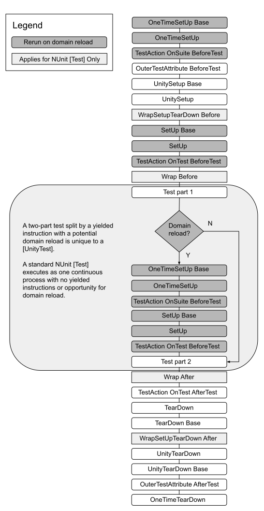

# Actions outside of tests

When writing tests, it is possible to avoid duplication of code by using the [SetUp and TearDown](https://docs.nunit.org/articles/nunit/technical-notes/usage/SetUp-and-TearDown.html) methods built into [NUnit](http://www.nunit.org/). The Unity Test Framework has extended these methods with extra functionality, which can yield commands and skip frames, in the same way as [UnityTest](./reference-attribute-unitytest.md).

## Action execution order

The actions related to a test run in the following order:

* Attributes implementing [IApplyToContext](https://docs.nunit.org/articles/nunit/extending-nunit/IApplyToContext-Interface.html) 
* Any attribute implementing [OuterUnityTestAction](./reference-outerunitytestaction.md) has its `BeforeTest` invoked
* Tests with [UnitySetUp](./reference-unitysetup-and-unityteardown.md) methods in their test class
* Attributes implementing [IWrapSetUpTearDown](https://docs.nunit.org/articles/nunit/extending-nunit/ICommandWrapper-Interface.html) 
* Any method with the [SetUp]) attribute
* [Action attributes](https://nunit.org/docs/2.6/actionAttributes.html) have their `BeforeTest` method invoked 
* Attributes implementing [IWrapTestMethod](https://docs.nunit.org/articles/nunit/extending-nunit/ICommandWrapper-Interface.html)  
* **The test itself runs**
* [Action attributes](https://nunit.org/docs/2.6/actionAttributes.html) have their `AfterTest` method invoked
* Any method with the [TearDown](https://docs.nunit.org/articles/nunit/technical-notes/usage/SetUp-and-TearDown.html) attribute
* Tests with [UnityTearDown](./reference-unitysetup-and-unityteardown.md) methods in their test class
* Any [OuterUnityTestAction](./reference-outerunitytestaction.md) has its `AfterTest` invoked

The list of actions is the same for both `Test` and `UnityTest`.

### Execution order flow

> **Note**: Some browsers do not support SVG image files. If the image above does not display properly (for example, if you cannot see any text), please try another browser, such as [Google Chrome](https://www.google.com/chrome/) or [Mozilla Firefox](https://www.mozilla.org). 

## Domain Reloads

In **Edit Mode** tests it is possible to yield instructions that can result in a domain reload, such as entering or exiting **Play Mode** (see [Custom yield instructions](./reference-custom-yield-instructions.md)). When a domain reload happens, all non-Unity actions (such as `OneTimeSetup` and `Setup`) are rerun before the code, which initiated the domain reload, continues. Unity actions (such as `UnitySetup`) are not rerun. If the Unity action is the code that initiated the domain reload, then the rest of the code in the `UnitySetup` method runs after the domain reload.