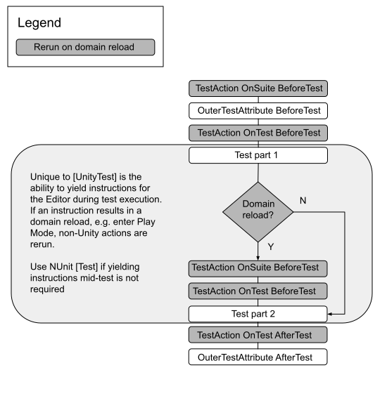

# OuterUnityTestAction

`OuterUnityTestAction` is a wrapper outside of the tests, which allows for any tests with this attribute to run code before and after the tests. This method allows for yielding commands in the same way as `UnityTest`. The attribute must inherit the `NUnit` attribute and implement `IOuterUnityTestAction`. 

## OuterUnityTestAction Example

```c#
using System.Collections;
using NUnit.Framework;
using NUnit.Framework.Interfaces;
using UnityEngine;
using UnityEngine.TestTools;

public class MyTestClass
{
    [UnityTest, MyOuterActionAttribute]
    public IEnumerator MyTestInsidePlaymode()
    {
        Assert.IsTrue(Application.isPlaying);
        yield return null;
    }
}

public class MyOuterActionAttribute : NUnitAttribute, IOuterUnityTestAction
{
    public IEnumerator BeforeTest(ITest test)
    {
        yield return new EnterPlayMode();
    }

    public IEnumerator AfterTest(ITest test)
    {
        yield return new ExitPlayMode();
    }
}

```
## Execution order

Unity outer test action is not rerun on domain reload but non-Unity action attributes are:



> **Note**: Some browsers do not support SVG image files. If the image above does not display properly (for example, if you cannot see any text), please try another browser, such as [Google Chrome](https://www.google.com/chrome/) or [Mozilla Firefox](https://www.mozilla.org). 

### Test actions with domain reload example

```csharp
using NUnit.Framework.Interfaces;


public class TestActionOnSuiteAttribute : NUnitAttribute, ITestAction
{
    public void BeforeTest(ITest test)
    {
        Debug.Log("TestAction OnSuite BeforeTest");
    }

    public void AfterTest(ITest test)
    {
    }

    public ActionTargets Targets { get { return ActionTargets.Suite; } }
}

public class TestActionOnTestAttribute : NUnitAttribute, ITestAction
{
    public void BeforeTest(ITest test)
    {
        Debug.Log("TestAction OnTest BeforeTest");
    }

    public void AfterTest(ITest test)
    {
        Debug.Log("TestAction OnTest AfterTest");
    }

    public ActionTargets Targets { get { return ActionTargets.Test; } }
}

public class OuterTestAttribute : NUnitAttribute, IOuterUnityTestAction
{
    public IEnumerator BeforeTest(ITest test)
    {
        Debug.Log("OuterTestAttribute BeforeTest");
        yield return null;
    }

    public IEnumerator AfterTest(ITest test)
    {
        Debug.Log("OuterTestAttribute AfterTest");
        yield return null;
    }
}

[TestActionOnSuite]
public class ActionOrderTestBase
{
    [Test, OuterTest, TestActionOnTest]   
    public void UnitTest()
    {
        Debug.Log("Test");
    }

    [UnityTest, OuterTest, TestActionOnTest]
    public IEnumerator UnityTestWithDomainReload()
    {
        Log("Test part 1");
        yield return new EnterPlayMode(); 
        //Domain reload
        yield return new ExitPlayMode();
        Log("Test part 2");
    }
}
```