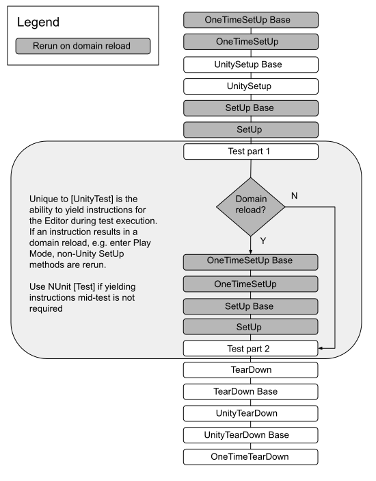

# UnitySetUp and UnityTearDown

The `UnitySetUp` and `UnityTearDown` attributes are identical to the standard `SetUp` and `TearDown` attributes, with the exception that they allow for [yielding instructions](reference-custom-yield-instructions.md). The `UnitySetUp` and `UnityTearDown` attributes expect a return type of [IEnumerator](https://docs.microsoft.com/en-us/dotnet/api/system.collections.ienumerator?view=netframework-4.8). 

## UnitySetUp and UnityTeardown example

```c#
public class SetUpTearDownExample
{
    [UnitySetUp]
    public IEnumerator SetUp()
    {
        yield return new EnterPlayMode();
    }

    [Test]
    public void MyTest()
    {
        Debug.Log("This runs inside playmode");
    }

    [UnityTearDown]
    public IEnumerator TearDown()
    {

        yield return new ExitPlayMode();
    }
}
```

## Execution order

`UnitySetUp` and `UnityTearDown` can be used with either the `Test` or `UnityTest` test attributes. In both cases the relative execution order of Unity and non-Unity `SetUp` and `TearDown` attributes is the same. The only difference is that a `UnityTest` allows for yielding instructions during the test that can result in a domain reload, in which case the non-Unity `SetUp` and `TearDown` methods are re-run before proceeding to the second part of the test.



> **Note**: Some browsers do not support SVG image files. If the image above does not display properly (for example, if you cannot see any text), please try another browser, such as [Google Chrome](https://www.google.com/chrome/) or [Mozilla Firefox](https://www.mozilla.org). 

## Base and Derived classes

The term **base** in the execution order denotes a base class from which a test class inherits. `UnitySetUp` and `UnityTearDown` follow the same pattern as NUnit `SetUp` and `TearDown` attributes in determining execution order between base classes and their derivatives. `SetUp` methods are called on base classes first, and then on derived classes. `TearDown` methods are called on derived classes first, and then on the base class. See the [NUnit Documentation](https://docs.nunit.org/articles/nunit/technical-notes/usage/SetUp-and-TearDown.html) for more details.

### Base and Derived class example

```csharp
    public class BaseClass
    {
        [OneTimeSetUp]
        public void OneTimeSetUp()
        {
            Debug.Log("OneTimeSetUp Base");
        }

        [SetUp]
        public void SetUp()
        {
            Debug.Log("SetUp Base");
        }

        [UnitySetUp]
        public IEnumerator UnitySetUp()
        {
            Debug.Log("UnitySetup Base");
            yield return null;
        }

        [TearDown]
        public void TearDown()
        {
            Debug.Log("TearDown Base");
        }

        [UnityTearDown]
        public IEnumerator UnityTearDown()
        {
            Debug.Log("UnityTearDown Base");
            yield return null;
        }
    }

    public class DerivedClass: BaseClass
    {
        [OneTimeSetUp]
        public new void OneTimeSetUp()
        {
            Debug.Log("OneTimeSetUp");
        }

        [SetUp]
        public new void SetUp()
        {
            Debug.Log("SetUp");
        }

        [UnitySetUp]
        public new IEnumerator UnitySetUp()
        {
            Debug.Log("UnitySetup");
            yield return null;
        }

        [Test]
        public void UnitTest()
        {
            Debug.Log("Test");
        }

        [UnityTest]
        public IEnumerator UnityTest()
        {
            Debug.Log("UnityTest before yield");
            yield return null;
            Debug.Log("UnityTest after yield");
        }

        [TearDown]
        public new void TearDown()
        {
            Debug.Log("TearDown");
        }

        [UnityTearDown]
        public new IEnumerator UnityTearDown()
        {
            Debug.Log("UnityTearDown");
            yield return null;
        }

        [OneTimeTearDown]
        public void OneTimeTearDown()
        {
            Debug.Log("OneTimeTearDown");
        }
    }
```
### Domain reload example

```csharp
    public class BaseClass
    {
        [OneTimeSetUp]
        public void OneTimeSetUp()
        {
            Debug.Log("OneTimeSetUp Base");
        }

        [SetUp]
        public void SetUp()
        {
            Debug.Log("SetUp Base");
        }

        [UnitySetUp]
        public IEnumerator UnitySetUp()
        {
            Debug.Log("UnitySetup Base");
            yield return null;
        }

        [TearDown]
        public void TearDown()
        {
            Debug.Log("TearDown Base");
        }

        [UnityTearDown]
        public IEnumerator UnityTearDown()
        {
            Debug.Log("UnityTearDown Base");
            yield return null;
        }
    }

    public class DerivedClass: BaseClass
    {
        [OneTimeSetUp]
        public new void OneTimeSetUp()
        {
            Debug.Log("OneTimeSetUp");
        }

        [SetUp]
        public new void SetUp()
        {
            Debug.Log("SetUp");
        }

        [UnitySetUp]
        public new IEnumerator UnitySetUp()
        {
            Debug.Log("UnitySetup");
            yield return null;
        }

        [Test]
        public void UnitTest()
        {
            Debug.Log("Test");
        }

        [UnityTest]
        public IEnumerator UnityTest()
        {
            Debug.Log("UnityTest before yield");
            yield return new EnterPlayMode(); 
            //Domain reload happening
            yield return new ExitPlayMode();
            Debug.Log("UnityTest after yield");
        }

        [TearDown]
        public new void TearDown()
        {
            Debug.Log("TearDown");
        }

        [UnityTearDown]
        public new IEnumerator UnityTearDown()
        {
            Debug.Log("UnityTearDown");
            yield return null;
        }

        [OneTimeTearDown]
        public void OneTimeTearDown()
        {
            Debug.Log("OneTimeTearDown");
        }
    }
```