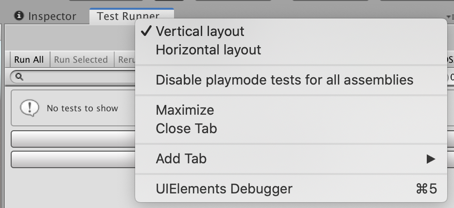

# Workflow: How to create a Play Mode test 

To create a **Play Mode** test, you can follow a similar process as when you want to create an **Edit Mode** test. 

1. Start with switching to the **PlayMode** tab in the **Test Runner** window.
2. Create a test assembly folder (see [How to create a new test assembly)](./workflow-create-test-assembly.md). The folder name is *Tests* by default (or *Tests 1*, *Tests 2*, etc. if the preceding name is already in use). 

> **Note**: If you don’t see the **Create Play Mode Test Assembly Folder** button enabled, make sure that in the Project window you navigate out of a folder with another .asmdef (such as one for Edit Mode tests). 

3. When you have your Play Mode test assembly folder ready, then [create your Play Mode test](./workflow-create-test.md). 

> **Note**: [Pre-defined Unity assemblies](https://docs.unity3d.com/Manual/ScriptCompileOrderFolders.html) (such as _Assembly-CSharp.dll_) do not reference your new assembly. 

## References and builds

Unity Test Framework adds a reference to `TestAssemblies` in the Assembly Definition file but does not include any other references (e.g., to other scripting assemblies within the Unity project). To test other assemblies, you need to add them to the assembly definition yourself. For how to add assembly references, see [Assembly Definition](https://docs.unity3d.com/Manual/ScriptCompilationAssemblyDefinitionFiles.html).
We recommend putting tests into separate assemblies and using assembly definitions files. This way you will have more control over which assemblies need to reference test related dlls.

#### Playmode build with TestsAssemblies 
> **Note**: **Enabling Play Mode tests for all assemblies** includes additional assemblies in your project build, which can increase the project’s size as well as the build time.
> 
The supported workflow is to exclude `TestAssemblies` from Player builds. You can choose to enable playmode tests for all assemblies to run your tests inside the Editor, but this should be disabled again before building the Player to prevent build failures.

To enable play mode tests for all assemblies you need to set the flag `playModeTestRunnerEnabled` to 1 inside the `ProjectSettings/ProjectSetting.asset` file in your project.
Before building the Player you must disable it again, either by setting the flag back to 0 or by clicking on `Disable playmode tests for all assemblies` in the dropdown menu, accessed by right-clicking on the Test Runner window tab.

For more information, see [Edit Mode vs. Play Mode tests](./edit-mode-vs-play-mode-tests.md).
