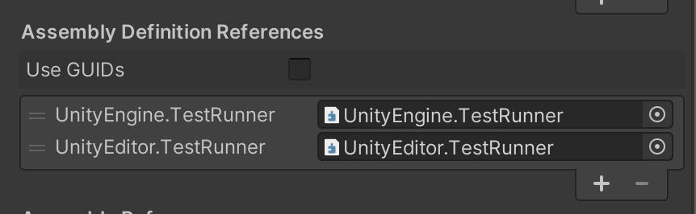

# Workflow: How to create a test

To create a test, do the following:

1. Create your *Test* [assembly folder](./workflow-create-test-assembly.md) and select it in the **Project** window.
2. Click the button **Create Test Script in current folder** option in the **Test Runner** window.

3. It creates a *NewTestScript.cs* file in the *Tests* folder. Change the name of the script, if necessary, and press Enter to accept it. 

Now you’ll see two sample tests in the Test Runner window:

Now you can open the tests in your favorite script editor.

You can also create test scripts by navigating to **Assets** > **Create > Testing** > **C# Test Script**, unless adding a test script would result in a compilation error.

> **Note**: Unity does not include `TestAssemblies` ([NUnit](http://www.nunit.org/), Unity Test Framework, and user script assemblies) when using the normal build pipeline, but does include them when using **Run on &lt;Platform&gt;** in the Test Runner window.

## Create additional tests

To create another set of tests:

1. In the **Project** window, select **Assets**.
2. Create a new test assembly folder (menu: **Assets > Create> Testing > Tests Assembly Folder**).
3. In the **Project** window, select the new folder.
4. Create a new test script in the folder (menu: **Assets > Create > Testing > C# Test Script**).

The assembly definition is assigned the same name as your new asset. To rename it, change the **Name** in the **Insepctor** window. Assembly definition names must be unique.

> **Note**: Changing the file name of the assembly definition file does not affect the value of the **Name** property in the file. Use the **Inspector** window to make sure the name is properly changed.

By default **Any Platform** is preselected as the target platform for the new assembly, which means the test script appears as a PlayMode test in the TestRunner window. To change it to an EditMode test, in the **Inspector** window select **Editor** only under **Platforms**.

New assemblies created through the **Assets** menu should automatically include references to `UnityEngine.TestRunner` and `UnityEditor.TestRunner`. If these references are missing, add them in the **Inspector** window under **Assembly Definition References**:

## Filters

If you have a lot of tests, and you only want to view/run a sub-set of them, you can filter them in three ways (see image above): 

* Type in the search box in the top left

* Click a test class or fixture (such as **NewTestScript** in the image above)

* Click one of the test result icon buttons in the top right

  

For more information, see [Edit Mode vs. Play Mode tests](./edit-mode-vs-play-mode-tests.md).
