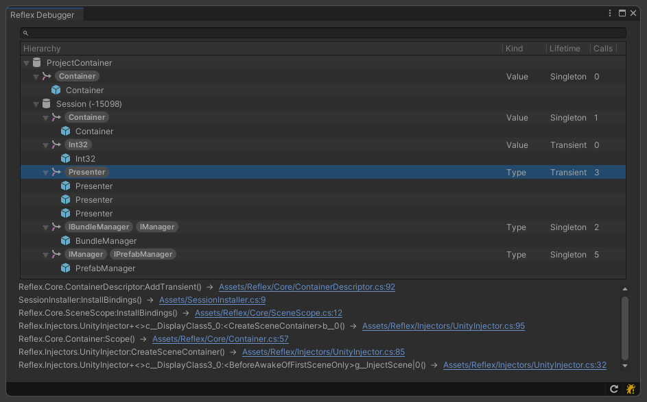

<div align=center>   

<p align="center">
  
</p>

### Blazing fast, minimal but complete dependency injection library for <a href="https://unity.com/">Unity</a>

Reflex is an [Dependency Injection](https://stackify.com/dependency-injection/) framework for [Unity](https://unity.com/). Making your classes independent of its dependencies, granting better separation of concerns. It achieves that by decoupling the usage of an object from its creation. This helps you to follow SOLID’s dependency inversion and single responsibility principles. Making your project more **readable, testable and scalable.**

[](https://opensource.org/licenses/MIT)

[](http://makeapullrequest.com)
[](https://github.com/gustavopsantos/reflex/releases)
[](https://openupm.com/packages/com.gustavopsantos.reflex/)
[](https://unity3d.com/pt/get-unity/download/archive)

</div>

---

<details>
<summary>📌 Table Of Contents</summary>

- [Overview](#-overview)
- [Installation](#-installation)
  - [Unity Package Manager](#unity-package-manager)
  - [Open Unity Package Manager](#open-unity-package-manager)
  - [Unity Package](#unity-package)
- [Getting Started](#-getting-started)
- [Scopes](#-scopes)
- [Bindings](#-bindings)
- [Resolving](#-resolving)
- [Decorating](#-decorating)
- [Callbacks](#-callbacks)
- [Debugger](#-debugger)
- [Settings](#-settings)
- [Performance](#-performance)
- [Scripting Restrictions](#-scripting-restrictions)
- [Support](#-support)
- [License](#-license)

</details>

---

## 👀 Overview
- **Fast:** ~3x faster than VContainer, ~7x faster than Zenject.
- **GC Friendly:** ~2x less allocations than VContainer, ~9x less allocations than Zenject.
- **AOT Support:** Basically theres no runtime Emit, so it works fine on IL2CPP builds. [<sup>[*]</sup>](#-scripting-restrictions)
- **Contract Table:** Allows usages of APIs like `container.All<IDisposable>`
- **Immutable Container**: Performant thread safety free of lock plus predictable behavior.

Compatible with the following platforms:

- iOS
- Android
- Windows/Mac/Linux
- PS4/PS5
- Xbox One/S/X and Xbox Series X/S
- WebGL

---

## 💾 Installation
You can install Reflex using any of the following methods:

### Unity Package Manager
```
https://github.com/gustavopsantos/reflex.git?path=/Assets/Reflex/#5.0.0
```

1. In Unity, open **Window** → **Package Manager**.
2. Press the **+** button, choose "**Add package from git URL...**"
3. Enter url above and press **Add**.

### Open Unity Package Manager

```bash
openupm install com.gustavopsantos.reflex
```

### Unity Package
1. Download the .unitypackage from [releases](https://github.com/gustavopsantos/reflex/releases) page.
2. Import Reflex.X.X.X.unitypackage

---

## 🚀 Getting Started
1. [Install Reflex](#installation)
2. Create `ProjectInstaller.cs` with 
```csharp
using Reflex.Core;
using UnityEngine;

public class ProjectInstaller : MonoBehaviour, IInstaller
{
    public void InstallBindings(ContainerDescriptor descriptor)
    {
        descriptor.AddSingleton("Hello");
    }
}
```
3. In unity project window
5. Create directory `Assets/Resources`
6. Select just created `Resources` dir
7. Right click, Create → Reflex → ProjectScope
8. With just created `ProjectScope` selected
9. Add `ProjectInstaller.cs` created at step 2 as a component
10. Create new scene `Greet`
11. Add `Greet` to `Build Settings` → `Scenes In Build`
12. Create `Greeter.cs` with
```csharp
using UnityEngine;
using Reflex.Core;
using System.Collections.Generic;

public class Greeter : IStartable // IStartable will force it to be constructed on container build
{
    public Greeter(IEnumerable<string> strings)
    {
        Debug.Log(string.Join(" ", strings));
    }

    public void Start()
    {
    }
}
```
12. Inside Greet scene, create a new empty gameobject named `SceneScope` and attach `SceneScope` component
13. Create `GreetInstaller.cs` with
```csharp
using Reflex.Core;
using UnityEngine;

public class GreetInstaller : MonoBehaviour, IInstaller
{
    public void InstallBindings(ContainerDescriptor descriptor)
    {
        descriptor.AddSingleton("World");
        descriptor.AddSingleton(typeof(Greeter), typeof(IStartable)); // IStartable will force it to be constructed on container build
    }
}
```
14. Add `GreetInstaller.cs` to `Greet.unity` `SceneScope`
15. Create new scene `Boot`
16. Add `Boot` to `Build Settings` → `Scenes In Build`
17. Create `Loader.cs` with
```csharp
using Reflex.Core;
using UnityEngine;
using UnityEngine.SceneManagement;

public class Loader : MonoBehaviour
{
    private void Start()
    {
	// If you are loading scenes without addressables
	var scene = SceneManager.LoadScene("Greet", new LoadSceneParameters(LoadSceneMode.Single));
	ReflexSceneManager.PreInstallScene(scene, descriptor => descriptor.AddSingleton("beautiful"));

	// If you are loading scenes with addressables
	Addressables.LoadSceneAsync("Greet", activateOnLoad: false).Completed += handle =>
	{
		ReflexSceneManager.PreInstallScene(handle.Result.Scene, descriptor => descriptor.AddSingleton("beautiful"));
		handle.Result.ActivateAsync();
	};
    }
}
```
18. Assign it to any gameobject at `Boot` scene
19. Thats it, hit play while on `Boot` scene
20. When Greet scene is loaded, there should be 3 instances implementing string contract
21. So when Geeter is constructed, you should see log: `Hello beautiful world`

---

## 📦 Scopes
Container scoping refers to the ability of being able to create a container inheriting the registrations of its parent container while also being able to extend it.

### Project Scope
It is root scope.
It is created just before first scene opens by relying on `[RuntimeInitializeOnLoadMethod(RuntimeInitializeLoadType.BeforeSceneLoad)]`
To register bindings to it, create a prefab, name it "ProjectScope", put it inside any Resources folder, and attach a "ProjectScope" component to it.
Then, create your installer as MonoBehaviour and implement IInstaller interface.
Remember to attach your installer to the ProjectScope prefab, as ProjectScope searches for every child implementing IInstaller when its time to create the ProjectScope container.
Theres a menu item to ease the process: Assets > Create > Reflex > ProjectScope
Remember to have a single ProjectScope to avoid undesired behaviour.
Note that ProjectScope prefab is not required, in case Reflex do not found ProjectScope, an empty root will be created.
ProjectScope instance will be disposed once app closes/app quits.
> Note that unity does not call OnDestroy deterministically, so rule of thum is do not rely on injected dependencies on OnDestroy event functions.

### Scene Scope
It is scoped from ProjectScope, so it contains everything that ProjectScope do.
It is created and injected after Awake, and before Start. 
To register bindings to it, create a gameobject on desired scene, name it "SceneScope", put it as root game object, and attach a "SceneScope" component to it.
Then, create your installer as MonoBehaviour and implement IInstaller interface.
Remember to attach your installer to your SceneScope gameobject, as SceneScope searches for every child implementing IInstaller when its time to create the SceneScope container.
Theres a menu item to ease the process: GameObject > Reflex > Scene Context
Remember to have a single SceneScope to avoid undesired behaviour.
Note that SceneScope gameobject is not required, in case Reflex do not found SceneScope, an empty one will be created.
SceneScope instance will be disposed once scene is unloaded.
> Note that unity does not call OnDestroy deterministically, so rule of thum is do not rely on injected dependencies on OnDestroy event functions. 

### Manual Scoping
```csharp
using var scopedContainer = parentContainer.Scope("Scoped", descriptor =>  
{  
  // Extend your scoped container by adding extra registrations here  
});
```

## 🔩 Bindings

### AddSingleton (From Type)
```csharp
ContainerDescriptor::AddSingleton(Type concrete, params Type[] contracts)
```
Adds a defered object creation based on the type to be constructed and its contracts.
The object will be constructed lazyli, once first request to resolve any of its contracts is called.
Then **same** object will always be returned.
If you want your singleton to be constructed just after container build (non-lazyli), add `typeof(IStartable)` as one of your contracts.
If object implements `IDisposable` it will be disposed when its parent Container are disposed.
Theres no need to pass `IDisposable` as contract to have your object disposed, howerver, if you want to retrieve all `IDisposable` by any API `Single<TContract>`, `Resolve<TContract>` or `All<TContract>` then yes, you have to specify it.

### AddSingleton (From Value)
```csharp
ContainerDescriptor::AddSingleton(object instance, params Type[] contracts)
```
Adds an object already contructed by the user to the container as a singleton, everytime the contracts given is asked to be resolved, the same object will be returned.
If object implements `IDisposable` it will be disposed when its parent Container are disposed.
Theres no need to pass `IDisposable` as contract to have your object disposed, howerver, if you want to retrieve all `IDisposable` by any API `Single<TContract>`, `Resolve<TContract>` or `All<TContract>` then yes, you have to specify it.

### AddSingleton (From Factory)
```csharp
ContainerDescriptor::AddSingleton<T>(Func<Container, T> factory, params Type[] contracts)
```
Adds a defered object creation based on the given factory and its contracts.
The object will be constructed lazyli, once first request to resolve any of its contracts is called.
The factory will be ran once, and then the **same** object will always be returned.
If you want your singleton to be constructed just after container build (non-lazyli), add `typeof(IStartable)` as one of your contracts.
If object implements `IDisposable` it will be disposed when its parent Container are disposed.
Theres no need to pass `IDisposable` as contract to have your object disposed, howerver, if you want to retrieve all `IDisposable` by any API `Single<TContract>`, `Resolve<TContract>` or `All<TContract>` then yes, you have to specify it.

### AddTransient (From Type)
```csharp
ContainerDescriptor::AddTransient(Type concrete, params Type[] contracts)
```
Adds a defered object creation based on the type to be constructed and its contracts.
The object will be constructed lazyli, once first request to resolve any of its contracts is called.
Then for any request of any contract, a new object will be created, use this carefully.
If object implements `IDisposable` it will be disposed when its parent Container are disposed.
Theres no need to pass `IDisposable` as contract to have your object disposed, howerver, if you want to retrieve all `IDisposable` by any API `Single<TContract>`, `Resolve<TContract>` or `All<TContract>` then yes, you have to specify it.
> Note that `IStartable` also works for **Transients** but pay attention that any resolve API will create a new instance

### AddTransient (From Value)
```csharp
ContainerDescriptor::AddTransient(object instance, params Type[] contracts)
```
Adds an object already contructed by the user to the container as a transient.
Its gonna be returned only on first time it gets resolved, second time an exception will be throw.
If object implements `IDisposable` it will be disposed when its parent Container are disposed.
Theres no need to pass `IDisposable` as contract to have your object disposed, howerver, if you want to retrieve all `IDisposable` by any API `Single<TContract>`, `Resolve<TContract>` or `All<TContract>` then yes, you have to specify it.

### AddTransient (From Factory)
```csharp
ContainerDescriptor::AddTransient(Func<Container, T> factory, params Type[] contracts)
```
Adds a defered object creation based on the given factory and its contracts.
The object will be constructed lazyli, once first request to resolve any of its contracts is called.
Then for any request of any contract, a new object will be created, use this carefully.
If object created by factory implements `IDisposable` it will be disposed when its parent Container are disposed.
Theres no need to pass `IDisposable` as contract to have your object disposed, howerver, if you want to retrieve all `IDisposable` by any API `Single<TContract>`, `Resolve<TContract>` or `All<TContract>` then yes, you have to specify it.
> Note that `IStartable` also works for **Transients** but pay attention that any resolve API will create a new instance

## 🔍 Resolving
### Constructor
If your type is non-mono, and its gonna be created by the container, then the most recommended way to inject dependencies into it its by constructor injection.
Its simply as just requesting the contracts you need as following example:
```csharp
private class Foo
{  
	...
  
	public NumberManager(IInputManager inputManager, IEnumerable<IManager> managers)  
	{  
		...
	}  
}
```

> Note that constructor injection relies on `Resolve<TContract>` API, so in case theres theres two objects with `IInputManager` contract, the last one will be injected. 

### Attribute
Attribute injection is the way to go for **MonoBehaviours**.
You can use it to inject fields, writeable properties and methods like following:
```csharp
class Foo : MonoBehaviour  
{  
	[Inject] private readonly IInputManager _inputManager;  
	[Inject] public IEnumerable<IManager> Managers { get; private set; }  
  
	[Inject]  
	private void Inject(IEnumerable<int> numbers) // Method name here does not matter  
	{  
	  ...
	}  
}
```
> Note that attribute injection also works on non-mono classes.
### Single
`Container::Single<TContract>` actually validates that theres a single binding implementing given contract, and returns it.
If theres more than one the following exception will be thrown.
```
InvalidOperationException: Sequence contains more than one element
```
Its recommended for every binding that you know that there should be a single binding implementing the contract.
### Resolve
`Container::Single<TContract>` runs no validations, and return the last valid object implementing given contract.

### All
`Container::All<TContract>` returns all objects implementing given contract.
Example:
```csharp
private void Documentation_Bindings()  
{  
	var container = new ContainerDescriptor("")  
		.AddSingleton(1)  
		.AddSingleton(2)  
		.AddSingleton(3)  
		.Build();  
  
	Debug.Log(string.Join(", ", container.All<int>())); // Prints: 1, 2, 3
}
```

## 🪆 Decorating
Reflex supports decorator pattern through de `ContainerDescriptor` API `AddDecorator`, heres an usage example:

```csharp
public interface INumber
{
    int Get();
}
```

```csharp
public class Number : INumber
{
    private int _value;
    public int Get() => _value;

    public static Number FromValue(int value)
    {
        return new Number
        {
            _value = value
        };
    }
}
```

```csharp
public class DoubledNumber : INumber
{
    private readonly INumber _number;
    public DoubledNumber(INumber number) => _number = number;
    public int Get() => _number.Get() * 2;
}
```

```csharp
public class HalvedNumber : INumber
{
    private readonly INumber _number;
    public HalvedNumber(INumber number) => _number = number;
    public int Get() => _number.Get() / 2;
}
```

```csharp
var container = new ContainerDescriptor("")
    .AddSingleton(Number.FromValue(10), contracts: typeof(INumber))
    .AddDecorator(typeof(DoubledNumber), typeof(INumber))
    .AddDecorator(typeof(HalvedNumber), typeof(INumber))
    .AddDecorator(typeof(DoubledNumber), typeof(INumber))
    .Build();

    var number = container.Single<INumber>();
    number.Get().Should().Be(20);
```
> An decorated singleton will respect singleton lifetime, returning always the same instance
  
> An decorated transient will respect transient lifetime, returning always a new instance

---

## 🪝 Callbacks
### `ContainerDescriptor::OnContainerBuilt`
OnContainerBuilt is a instance callback of ContainerDescriptor, its called once the container is fully built and initialized properly. 

---

## 🐛 Debugger
  
It can be accessed by menu item  Reflex → Debugger.  
To enable reflex debug mode you must go to Edit → Project Settings → Player, then in the Other Settings panel, scroll down to Script Compilation → Scripting Define Symbols and add `REFLEX_DEBUG`. This can be easily achieved by clicking on the bug button at bottom right corner inside Reflex Debugger Window.
> Note that debug mode reduces performance and increases memory pressure, so use it wisely.  

And from there you can check:
- Container Hierarchy
- Implementation
- Contracts
- Resolution Count
- Binding Type
- Binding assignment call stack

---

## 🪛 Settings
Its a  `ReflexSettings` scriptable object instance, named `ReflexSettings` that should live inside a `Resources` folder.
It can be created by asset menu item Assets → Create → Reflex → Settings.

Currently, logging verbosity is configured in this file, and default value is set to `Info`

> Non-Obligatory to have but projects without it will fallback using default settings

---

## 📊 Performance
> Resolving ten thousand times a transient dependency with four levels of chained dependencies. See [NestedBenchmarkReflex.cs](Assets/Reflex.Benchmark/NestedBenchmarkReflex.cs).

### Android + Mono
|           | GC      | Time    | GC Ratio | Time Ratio |
|-----------|--------:|--------:|---------:|-----------:|
| Reflex    | 54.7KB  | 9.3ms   | 1x       | 1x         |
| Zenject   | 512KB   | 63.2ms  | 9.36x    | 6.79x      |
| VContainer| 128.9KB | 29.8ms  | 2.35x    | 3.20x      |

### Android + IL2CPP
|           | GC      | Time   | GC Ratio | Time Ratio |
|-----------|--------:|-------:|---------:|-----------:|
| Reflex    | 140.6KB | 7.4ms  | 1x       | 1x         |
| Zenject   | 1024KB  | 23.6ms | 7.28x    | 3.18x      |
| VContainer| 257.8KB | 9.2ms  | 1.83x    | 1.24x      |

### Windows + Mono
|           | GC      | Time   | GC Ratio | Time Ratio |
|-----------|--------:|-------:|---------:|-----------:|
| Reflex    | 109.4KB | 1.2ms  | 1x       | 1x         |
| Zenject   | 1024KB  | 9.2ms  | 9.36x    | 7.66x      |
| VContainer| 257.8KB | 3.3ms  | 2.35x    | 2.75x      |

### Windows + IL2CPP
|           | GC      | Time   | GC Ratio | Time Ratio |
|-----------|--------:|-------:|---------:|-----------:|
| Reflex    | 140.6KB | 2.9ms  | 1x       | 1x         |
| Zenject   | 1024KB  | 9.3ms  | 7.28x    | 3.20x      |
| VContainer| 257.8KB | 5.1ms  | 1.83x    | 1.75x      |

## 🚫 Scripting Restrictions
If you are taking advantage of reflex to inject `IEnumerable<T>` in your constructors **AND** your are building for **IL2CPP**, you will probably get some exceptions like following:

```
System.ExecutionEngineException: Attempting to call method 'System.Linq.Enumerable::Cast<ANY-TYPE>' for which no ahead of time (AOT) code was generated.
```

This happens because compiler does not know at compile time that a specific `System.Linq.Enumerable::Cast<T>` should be included. And currently Reflex does not implement any type of assembly weaving.
> Reflex 4.0.0 had and assembly weaver that was relying on unity UnityEditor.Compilation.CompilationPipeline events and Mono.Cecil. But it was causing conflicts with projects using Burst. So its being removed temporarly until a definitive solution is found.
> Most probably we are going to weave assemblies the same way unity is doing for Burst as well.

Temporary workaround example:

```csharp
class NumberManager
{
    public IEnumerable<int> Numbers { get; }

    public NumberManager(IEnumerable<int> numbers)
    {
        Numbers = numbers;
    }
    
    // https://docs.unity3d.com/Manual/ScriptingRestrictions.html
    [Preserve] private static void UsedOnlyForAOTCodeGeneration()
    {
        Array.Empty<object>().Cast<int>(); // This compiler hint will get rid of: System.ExecutionEngineException: Attempting to call method 'System.Linq.Enumerable::Cast<System.Int32>' for which no ahead of time (AOT) code was generated. 
        throw new Exception("This method is used for AOT code generation only. Do not call it at runtime.");
    }
}
```

## 🤝 Support

Ask your questions and participate in discussions regarding Reflex related and dependency injection topics at the Reflex Discord server. 

<a href="https://discord.gg/XM47TsGScH"></a>

---

## 📜 License
Reflex is distributed under the terms of the MIT License.
A complete version of the license is available in the [LICENSE](LICENSE) file in
this repository. Any contribution made to this project will be licensed under
the MIT License.
